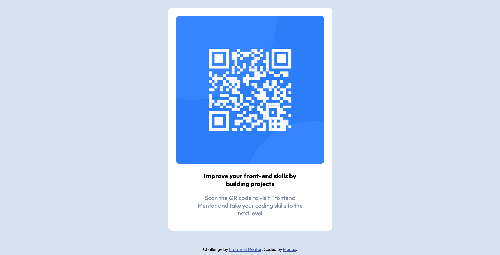

# Frontend Mentor - QR code component solution

This is a solution to the [QR code component challenge on Frontend Mentor](https://www.frontendmentor.io/challenges/qr-code-component-iux_sIO_H). Frontend Mentor challenges help you improve your coding skills by building realistic projects. 

## Table of contents

- [Overview](#overview)
  - [Screenshot](#screenshot)
  - [Links](#links)
- [My process](#my-process)
  - [Built with](#built-with)
  - [What I learned](#what-i-learned)
  - [Continued development](#continued-development)
  - [Useful resources](#useful-resources)
- [Author](#author)
- [Acknowledgments](#acknowledgments)


## Overview

### Screenshot




### Links

- Solution URL: [Add solution URL here](https://your-solution-url.com)
- Live Site URL: [Add live site URL here](https://your-live-site-url.com)

## My process

### Built with

- Semantic HTML5 markup
- CSS custom properties

### What I learned

This is recap of my past learnings.

```html
<h1>Some HTML code I'm proud of</h1>
```
```css
.proud-of-this-css {
    margin-inline: auto;
    object-fit: contain;
}
```
```js
const proudOfThisFunc = () => {
  console.log('🎉')
}
```

### Continued development

I revised the following css properties

```css
    margin-inline: auto;
    object-fit: contain;
```
- I will build this using FlexBox or CSS Grid
- also will build this with react and make it more responsive


### Useful resources

- [Google Fonts](https://fonts.google.com/) - This website helped me to use fonts for free and style my components.

## Author

- Website - [Manas Ranjan - Portfolio](https://manasranjan-portfolio.netlify.app/)
- Frontend Mentor - [@codewithmanas](https://www.frontendmentor.io/profile/codewithmanas)
- Twitter - [@holaaa_manas](https://twitter.com/holaaa_manas)

## Acknowledgments
Must do this challenge if you just starting out web development journey. This will be very helpful to make you think about how to write html and css in real projects.